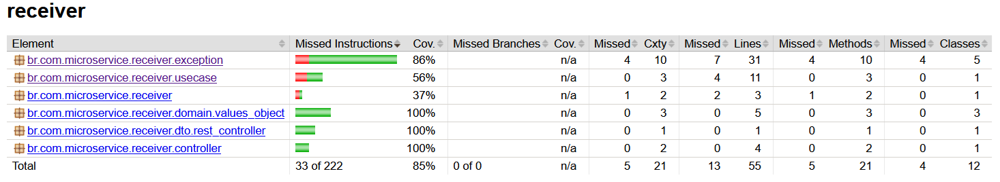

# Tech Challenge 04 - Pedido Receiver

- Introdução
- Funções
- Tecnologias
- Instalação
- API
- Qualidade de software

***

## Introdução

Esta aplicação é parte de um sistema de gerenciamento de pedidos e estoque com o framework Springboot. Este microsserviço recebe um pedido e o direciona para uma fila para ser processado. 

O projeto pode ser acessado em: https://github.com/eduardoesr/micro-receiver-clean-arch

***

## Funções

* Receber um pedido com itens comprados e dados do cliente.
* Repassar o pedido para uma fila. 

***

## Tecnologias

* Springboot: Framework web
* Maven: Gerenciador de dependências
* Swagger: Documentação e interface para testes
* RabbitMQ: Broker de mensagens

***

## Instalação

* Instalar Docker Desktop.
* Baixe os arquivos repositório. `https://github.com/eduardoesr/micro-receiver-clean-arch`.
* Entre na pasta do repositório. `cd micro-receiver-clean-arch`.
* Execute o projeto com o Docker Compose.
    * Utilize este comando no terminal: `docker-compose up --build`.
 
Este docker-compose irá rodar o microsserviço do Springboot e o RabbitMQ que receberá as mensanges repassadas.

O Swagger pode ser acessado diretamente em `http://localhost:8085/swagger-ui/index.html`.

***

### Enviar pedido: `POST /receiver`
Exemplo de envio:
  ```
{
    "idCliente": "cliente123",
    "dataPedido": "2024-03-20T10:30:00",
    "produtos": [
        {
            "sku": "SKU1",
            "quantidade": 2
        },
        {
            "sku": "SKU2",
            "quantidade": 1
        }
    ],
    "endereco": {
        "cep": "12345-678",
        "logradouro": "Rua Teste",
        "latitude": 100,
        "longitude": 200
    },
    "valorTotal": 50.00,
    "metodoPagamento": "PIX"
}
  ```

## API

### Enviar Pedido

| Método | URL                            | Ação                                                        |
|--------|--------------------------------|-------------------------------------------------------------|
| POST   | /receiver                      | Recebe um pedido e direciona para o RabbitMQ.               |

## Qualidade de software

### Testes

Foi realizado testes na API, buscando alcançar mais de 80% de cobertura

<div align="center">
    
</div>

